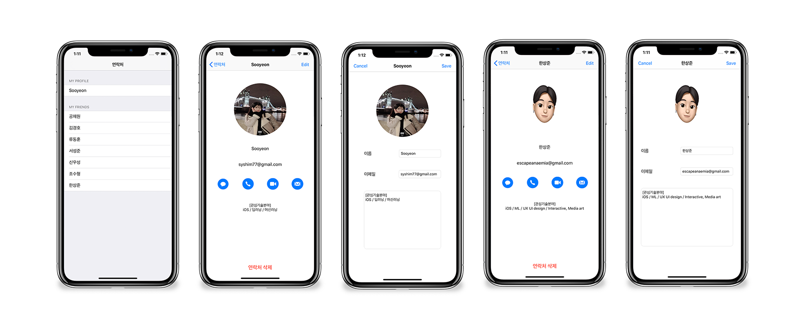

# 2 주차 실습

## 기초 단계 (필수)
- 위 사진 속 제시된 UX / UI를 반영
- 첫번째 뷰의 경우 반드시 UITableView를 이용하여 구현한다.
- UITableViewDelegate와 UITableViewDatasource를 이용해야한다.
- 자신의 프로필과 다른 유저의 프로필은 구분해야한다. 
- 기본 자료형을 활용해서 데이터를 구성한다. 
## 중간 단계 (선택)
- Singleton을 사용하여 변경된 내용이 반영되도록 구현
## 심화 단계 (선택)
- Image Picker 추가 후 프로필 속 사진 변경 기능
- 라이브러리 없이 직접 picker 호출
- NSDataAsset에 대한 학습 후 데이터 관리 방식 변경
- UserDefault를 활용하여 앱이 종료 후 다시 실행해도 변경된 내용이 반영되도록 구현