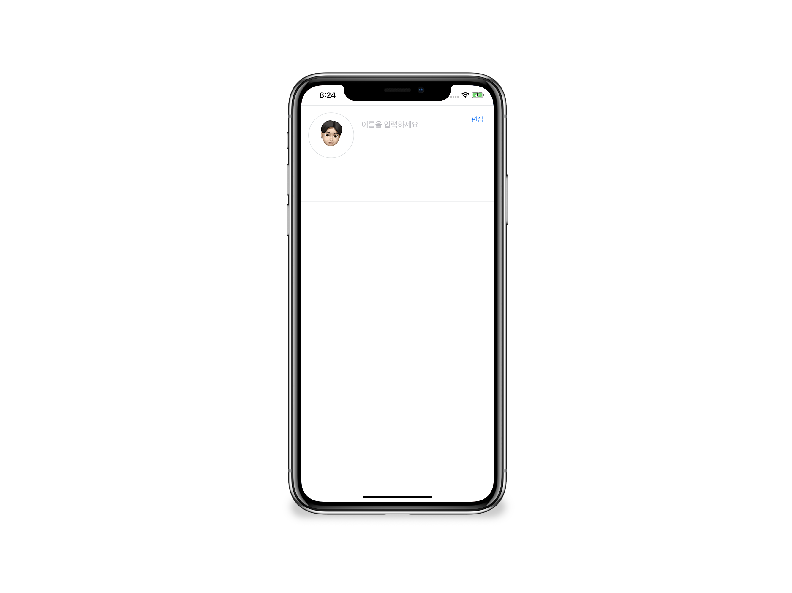

# 1 주차 실습

## 기초 단계 (필수)
- 편집 버튼과 이름, 메모 입력을 만든다.
- 편집 버튼은 UIButton을 이용해서, 이름은 UITextField, 메모는 UITextView를 이용해서 만든다.
- 편집 버튼을 누르면 이름과 메모를 입력할 수 있도록 한다.
- 편집 버튼을 누르면 편집 버튼이 저장 버튼으로 변경되야한다.
- 저장 버튼을 누르면 입력한 이름, 메모가 반영되고 더이상 편집이 되면 안된다.

## 중간 단계 (선택)
- UIImage를 이용해 프로필 이미지를 추가한다.
- 프로필 이미지가 동그랗게 보이도록 한다.
- 프로필 이미지에 회색 태두리 넣는다.
- 프로필 뷰에 회색 선 넣는다.
- AutoLayout 적용 후 여러 simulators 에서도 같은 뷰를 제공한다.

## 심화 단계 (선택)
- Extension을 활용해서 코드의 재사용성 높이기
	- UIView를 동그랗게 만드는 함수 추가한다.
	- UIView 테두리 추가 함수 추가한다.
	- 커스텀 color를 추가한다.